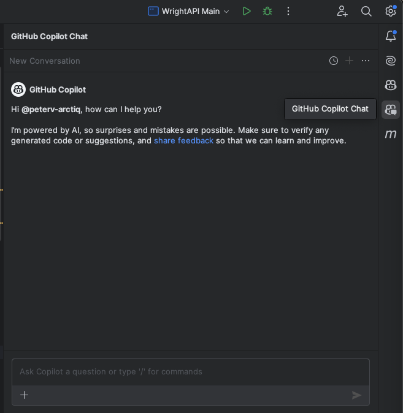
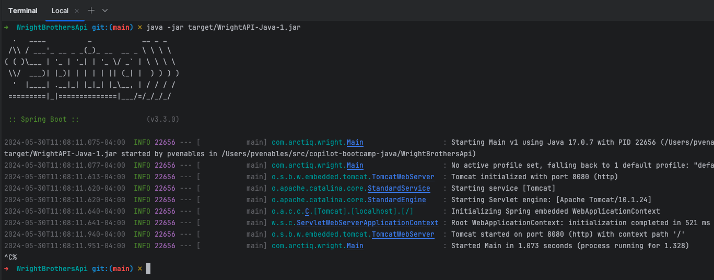
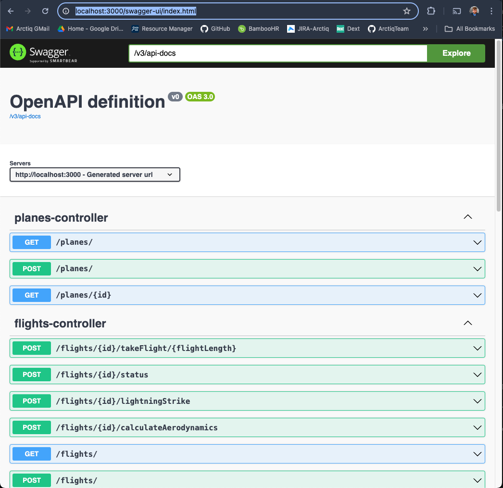
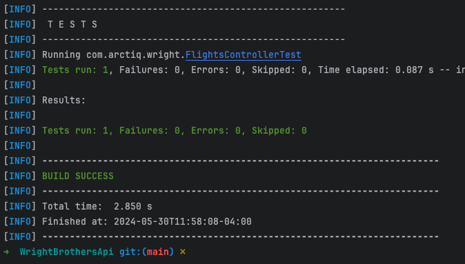

# Lab 1.1 - Pre-Flight Checklist: Setting Up GitHub Copilot and your repository

Compare this to "Preparing Your Travel Itinerary, Checking Passport, Printing Boarding Pass". Just as travelers plan their journey, participants will set up their GitHub repository, planning their coding journey. In this Hands-On Lab, you will learn how to navigate GitHub, create a new issue and obtain your own GitHub repo with the code for these hands-on labs. You will be working on your own repo in the following labs.

## Estimated time to complete

- 10 min

## Objectives

- Set up your development environemnt, and configure your local clone of the repository.
    - Step 1: Set up your development environment
    - Step 2: Verify Copilot Functionality
    - Step 3: Verify the application runs
    - Step 4: Verify calling the REST API

You can now use the development environment to work on the exercises in the Hands on Labs. 🔨

### Step 1: Set up your development environment

#### Install development tools

- Install [Git](https://git-scm.com/downloads)
- Install [JetBrains IntelliJ IDEA](https://www.jetbrains.com/idea/download) or [Eclipse IDE](https://www.eclipse.org/downloads/)
- Install [Maven](https://maven.apache.org/download.cgi)
- (Optional) Install [Postman](https://www.postman.com/downloads/)
- IntelliJ Plugins:
    - [GitHub Copilot](https://plugins.jetbrains.com/plugin/17718-github-copilot)

#### Clone the repository

- Run the following command in the terminal to clone the repository:

    ```sh
    git clone https://github.com/ArctiqTeam/copilot-bootcamp-java.git
    ```

### Step 2: Verify Copilot Functionality

#### Hello to Copilot

- Click on the "GitHub Copilot Chat" icon on the right side of the screen to open the chat.

> NOTE: There are two Github Icons in IntelliJ, "GitHub Copilot" and "GitHub Copilot Chat"



- Type `Hello` and press `Enter` to interact with Copilot.

## Optional Verification Steps

### Step 3: Verify the application runs

#### Run application

- Startup the application and verify the application is running.
- From the terminal window, navigate to the application folder: `cd ./WrightBrothersApi`
- Install the application dependencies by typing the following command in the terminal:
    
    ```sh
    mvn install
    mvn package
    ```

- Run the application by typing the following commands in the terminal:

    ```sh
    java -jar target/WrightAPI-Java-1.jar
    ```

- You should see some output like this:



### Step 4: Verify calling the REST API

#### Swagger UI

This application has a Swagger UI that can be used to validate the API is operational. Once the server is running, open a broswer to the following URL on your local host.

```
http://localhost:3000/swagger-ui/index.html
```

And if all is well, you should see the Swagger UI:



From this point you can pick an endpoint you want to try out, the first endpoint is sufficient. 

- Click on "GET /planes/" under "planes-controller" to expand the selection, 
- Click on "Try it out" on the right side of the newly expanded area.
- Click on "Execute" and view the output that should show a list of three planes with associated data.

#### Rest Client Extension

The REST API client extension is very useful to quickly execute HTTP requests in your IDE and have all HTTP requests in source control.

> Note: If you are using IntelliJ CE you will not have access to this helpful utility as it is limited to the Ultimate Edition. 

- Open the `Examples/Flights.http` file, click `Send Request` to execute the `takeFlight` request.

    ```
        Send Request
    POST http://localhost:3000/flights/1/takeFlight/75 HTTP/1.1
    content-type: application/json
    ```

- You will see that the flight is taking off and the response is `200 OK`.

- Response will be:

    ```md
    HTTP/1.1 200 OK

    ...
    
    Connection: close

    Flight took off and flew 75 kilometers/miles.
    ```

- Stop the application by pressing `Ctrl+C` in the terminal window.

#### Postman (Optional)

Using the requests defines in `Examples` you can create requests in Postman and try them out. 

#### Verify the unit tests

- Run existing unit tests in the `Tests` folder by typing the following command in the terminal:

    ```sh
    mvn test
    ```

- The tests should run and pass.



### Congratulations you've made it to the end! &#9992;

#### And with that, you've now concluded this module. We hope you enjoyed it! &#x1F60A;
