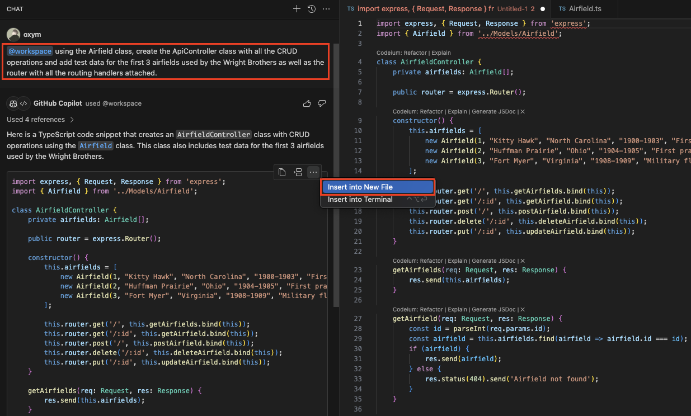

# Lab 2.1 - Flight demonstration: Basic Coding with Copilot Assistance

This module demonstrates how to utilize GitHub Copilot's Chat Extension and its agents (@workspace, @terminal, @vscode) to understand and navigate a codebase, implement REST API methods, generate code from comments, and maintain coding style consistency, culminating in a comprehensive, productivity-enhancing coding experience.

## Prerequisites
- The prerequisites steps must be completed, see [Labs Prerequisites](../Lab%201.1%20-%20Pre-Flight%20Checklist/README.md)

## Estimated time to complete

- 20 minutes, times may vary with optional labs.

## Objectives

- Introduction to GitHub Copilot Chat and its agents for code completion and style adaptation.

    - Step 1 - Plane Inspection - Explain the Codebase with GitHub Copilot Chat
    - Step 2 - Airplane Docking - Add new Flight Model
    - Step 3 - Test Flight - Autocompletion and Suggestions
    - Step 4 - Flight Plan - Code Completion and Style Adaptation
    - Step 5 - Laying Down the Runway - Creating the AirfieldController from thin air (Optional)

> [!IMPORTANT]  
> Please note that Copilot's responses are generated based on a mix of curated data, algorithms, and machine learning models, which means they may not always be accurate or reflect the most current information available. Users are advised to verify Copilot's outputs with trusted sources before making decisions based on them.

### Step 1: Plane Inspection - Explain the Codebase with GitHub Copilot Chat

- Open GitHub Copilot Chat

- Type the following in the chat window:

Compare the difference between asking the two following things:

1) without @workspace:

```
explain the WrightBrothers API
```

2) with @workspace:

```
@workspace explain the WrightBrothers API
```

- Copilot will give a brief overview of the API. This is a good way to get a quick overview of the codebase.

GitHub Copilot has the concept of Agents. `@workspace` is an agent that is specialized in answering questions about the currently open workspace.

Compare the difference between asking the two following things:

1) without workspace:

```
what does the PlanesController do?
```

2) with workspace:

```
@workspace what does the PlanesController do?
```

> [!NOTE]  
> What the `@workspace` agent does, is look at the opened Workspace in VS Code (usually a folder or a project), and use the file tree information to analyze each file briefly and see if it would be intesting context to send into Copilot. This analysis happens clientside and only the files that match (for example the file name indicates a match, or a piece of the file content looks like a match), then those files/parts are send in as extra context. This can be seen in the "Used x references" in the Chat interface that can be openened and reviewed for the file references.

> [!IMPORTANT]  
> When asking follow-up questions, the @agent needs to be provided again. For example, if you ask `@workspace` a question and then ask another question, you need to type `@workspace` again.

- There are two other Agents `@terminal` and `@vscode`. They are used to help navigate the terminal and VS Code settings respectively.

- Try `@terminal` agent by typing the following in the chat window:

    ```md
    @terminal how to run the application
    ```

- GitHub Copilot will tell that it needs more information:

    ```md
    I'm sorry, but I need more information about your application. Could you please specify the programming language or the command usually used to run your application?
    ```

> [!NOTE]
> `@terminal` agent is used to help navigate the terminal and does not have the context of the codebase. It is used to answer generic questions about how to do things in the terminal.

- Try `@terminal` again by typing the following in the chat window:

```md
@terminal how to run a typescript project managed by npm
```

- This is a generic question about running a application in the terminal. Copilot will give a suggestion to run the application in the terminal.

```sh
npm run build && npm start
```

```md
This command will first compile your TypeScript code into JavaScript using the `npm run build` command (assuming your `package.json` has a build script for tsc), and then run the compiled JavaScript code with `npm start`.
```

- It will give a suggestion to run the application in the terminal.

- Next, try `@vscode` agent by typing the following in the chat window:

```
@vscode how to install the extensions?
```

- It will provide a corresponding setting or an action button to install extensions.

### Step 2: Airplane Docking - Add new Flight Model

- Open GitHub Copilot Chat, click **+** to clear prompt history.

- Ask Copilot to explain the `PlanesController.ts` class

    ```
    @workspace What does the PlanesController do?
    ```

> [!NOTE]
> GitHub Copilot will give a brief overview of the `PlanesController.ts` class.

- Now that we know what the PlanesController does, open `WrightBrothersApi` folder.

- Open the `Controllers/PlanesController.ts` file.

```typescript
class PlanesController {
    /* Rest of the methods */

    constructor() {
        this.router = express.Router();
        this.planes = [
        /* Other planes */
        
        {
            id: 3,
            name: "Wright Model A",
            year: 1908,
            description: "The first commercially successful airplane.",
            rangeInKm: 40
        }<---- Place your cursor here
        ];
    }
}
```

- Let's add a new plane to the list by placing your cursor at the end of the `Planes` list, after the `}` of `Plane` with `Id = 3`, type a `,` then press `Enter`.

- GitHub Copilot will automatically suggest a `new Plane`.

> [!NOTE]
> GitHub Copilot will suggest a new `Plane` object with the next available `Id`. Also notice how Copilot understood that the next Plane is the Wright Model B and it automatically suggested the `Name`, `Year`, `Description`, and `RangeInKm` properties. The underlying LLM also learned from Wikipedia and other sources to understand the history of the Wright Brothers.

- Accept the suggestion by pressing `Tab` to accept this suggestion.

### Step 3: Test Flight - Autocompletion and Suggestions

- Open `WrightBrothersApi` folder.

- Open the `Controllers/PlanesController.ts` file.

- Place your cursor at the end of the file, after the `}` of the `createPlane` method, press `Enter` twice.

```typescript
class PlanesController {
    /* Rest of the methods */

    private createPlane(req: Request, res: Response) {
        // Method body
    }

    <---- Place your cursor here
}
```

- Github Copilot will automatically suggest the `updatePlane` method, press `Tab` to accept.

    ```typescript
    // * Suggested by Copilot
    private updatePlane(req: Request, res: Response) {
        const planeId = Number(req.params.id);
        const { name, year, description, rangeInKm } = req.body;
        const plane = this.planes.find(plane => plane.id === planeId);

        if (!plane) {
            res.status(404).send('Plane not found');
        } else {
            plane.name = name;
            plane.year = year;
            plane.description = description;
            plane.rangeInKm = rangeInKm;

            res.json(plane);
        }
    }
    // * Suggested by Copilot
    ```

> [!NOTE]
> The reason GitHub Copilot suggests the `updatePlane` method is because it understand that the `PlanesController.ts` class is a REST API controller and that the `updatePlane` is currently missing. The `updatePlane` method is the next logical step in the REST API for updating a resource.

- Let's do it again, place your cursor at the end of the file, after the `}` of the `Put` method, press `Enter` twice.

- Copilot will automatically suggest the `deletePlane` method, press `Tab` to accept.

    ```typescript
    // * Suggested by Copilot
    private deletePlane(req: Request, res: Response) {
        const planeId = Number(req.params.id);
        const planeIndex = this.planes.findIndex(plane => plane.id === planeId);

        if (planeIndex === -1) {
            res.status(404).send('Plane not found');
        } else {
            this.planes.splice(planeIndex, 1);
            res.status(204).send();
        }
    }
    // * Suggested by Copilot
    ```

- Now, let's add the missing routing handlers for `Put` and `Delete` methods to the router.

- Place your cursor at the end of the routing handlers , after the `;` of the `Post` method, press `Enter`.

```typescript
class PlanesController {
    private router: express.Router;
    private planes: IPlane[];
    /* Rest of the methods */

    this.router.get('/', this.getAllPlanes.bind(this));
    this.router.get('/:id', this.getPlaneById.bind(this));
    this.router.post('/', this.createPlane.bind(this));
    <---- Place your cursor here
}
```

- GitHub Copilot will automatically suggest the `Put` method.

    ```typescript
    this.router.put('/:id', this.updatePlane.bind(this));
    ```

- press `Enter` again.

- GitHub Copilot will automatically suggest the `Delete` method.

    ```typescript
    this.router.delete('/:id', this.deletePlane.bind(this));
    ```

### Step 4: Test Flight Accelerate - Comments to Code

- Open `WrightBrothersApi` folder.

- Open the `Controllers/PlanesController.ts` file.

- Type `// Search planes by name` in the comment block. After the `}` of the `getAllPlanes` method, press `Enter`.

    ```typescript
    // Search planes by name
    ```
    
    ```typescript
    class PlanesController {
        /* Rest of the methods */

        private createPlane(req: Request, res: Response) {
            // Method body
        }

        <---- Place your cursor here
        // Search planes by name
    }
    ```

- GitHub Copilot will automatically suggest the `getPlaneByName` method, press `Tab` to accept.

    ```typescript
    // Search planes by name
    // * Suggested by Copilot
    private getPlaneByName(req: Request, res: Response) {
        const name = req.query.name as string;
        const plane = this.planes.find(plane => plane.name === name);

        if (!plane) {
            res.status(404).send('Plane not found');
        } else {
            res.json(plane);
        }
    }
    // * Suggested by Copilot
    ```

> [!NOTE]
> The reason GitHub Copilot suggests the `getPlaneByName` method is because it understands that the comment is a description of the method. It also understands that the method is a GET method and that it has a parameter `name` of type `string`.

- Let's add the missing routing handler for the `getPlaneByName` method to the router.

- Place your cursor at the end of the routing handlers, after the `;` of the `Delete` method, press `Enter`.

```typescript
class PlanesController {
    private router: express.Router;
    private planes: IPlane[];
    /* Rest of the methods */

    this.router.delete('/:id', this.deletePlane.bind(this));
    <---- Place your cursor here
}
```

- GitHub Copilot will automatically suggest the handler for the `getPlaneByName` method.

    ```typescript
    this.router.get('/search', this.getPlaneByName.bind(this));
    ```

- Let's do it again, place your cursor before the `if (!plane)` line, at the end of the `const plane = ... rangeInKm);` line, in the `createPlane(req: Request, res: Response)` method, press `Enter` twice.

- Type `// Return BadRequest if plane already exists by name` in the comment block. Before the `if(plane == null)` of this method, press `Enter`.

    ```typescript
    // Return BadRequest if plane already exists by name
    ```

    ```typescript
    private createPlane(req: Request, res: Response) {
        const { id, name, year, description, rangeInKm } = req.body;
        const plane = new Plane(id, name, year, description, rangeInKm);

        <---- Place your cursor here

        if (!plane) {
            res.status(400).send('Bad request');
        }

        this.planes.push(plane);
        res.status(201).json(plane);
    }
    ```
- Copilot will automatically suggest the `if` statement and return `Plane already exists` if the plane already exists by name.

    ```typescript
    private createPlane(req: Request, res: Response) {
        const { id, name, year, description, rangeInKm } = req.body;
        const plane = new Plane(id, name, year, description, rangeInKm);

        // Return BadRequest if plane already exists by name
        if (this.planes.find(p => p.name === plane.name)) {
            res.status(400).send('Plane already exists');
        }

        if (!plane) {
            res.status(400).send('Bad request');
        }

        this.planes.push(plane);
        res.status(201).json(plane);
    }
   ```

### Step 5: Laying Down the Runway - Creating the AirfieldController from thin air (Optional)

- Open the `WrightBrothersApi` folder in Visual Studio Code.

- Open the `Models/Airfield.ts` file.

- Open GitHub Copilot Chat, click **+** to clear prompt history.

- Ask the following question:

    ```
    @workspace using the Airfield class, create a new ApiController class with all the CRUD operations and add test data for the first 3 airfields used by the Wright Brothers as well as the router with all the routing handlers attached.
    ```

- Copilot will give a suggestion to create an `AirfieldController` class based on the `Airfield` class.

    ```typescript
    import express, { Request, Response } from 'express';
    import { Airfield } from '../Models/Airfield';

    class AirfieldsController {
        private airfields: Airfield[];

        public router = express.Router();

        constructor() {
            this.airfields = [
                new Airfield(1, "Kitty Hawk", "North Carolina", "1900-3000", "First successful flight"),
                new Airfield(2, "Huffman Prairie", "Ohio", "1904-1905", "First practical airplane"),
                new Airfield(3, "Fort Myer", "Virginia", "1908-1909", "Military flight trials")
            ];

            this.router.get('/', this.getAirfields.bind(this));
            this.router.get('/:id', this.getAirfield.bind(this));
            this.router.post('/', this.postAirfield.bind(this));
            this.router.delete('/:id', this.deleteAirfield.bind(this));
            this.router.put('/:id', this.updateAirfield.bind(this));
        }

        // GET: 
        getAirfields(req: Request, res: Response) {
            res.send(this.airfields);
        }

        // GET: 3
        getAirfield(req: Request, res: Response): void {
            const id = parseInt(req.params.id);
            if (id < 0 || id >= this.airfields.length) {
                res.status(404).send("Airfield not found");
            }
            res.status(200).send(this.airfields[id]);
        }

        // POST: 
        postAirfield(req: Request, res: Response): void {
            const airfield: Airfield = req.body;
            this.airfields.push(airfield);
            res.status(201).send(airfield);
        }

        // DELETE:
        deleteAirfield(req: Request, res: Response): void {
            const id = parseInt(req.params.id);
            const index = this.airfields.findIndex(a => a.id === id);
            if (index === -1) {
                res.status(404).send("Airfield not found");
                return;
            }

            this.airfields.splice(index, 1);
            res.status(200).send("Airfield with id: " + id + " deleted");
        }

        // PUT: 2
        updateAirfield(req: Request, res: Response): void {
            const id = parseInt(req.params.id);
            const index = this.airfields.findIndex(a => a.id === id);
            if (index === -1) {
                res.status(404).send("Airfield not found");
                return;
            }
            const airfield: Airfield = req.body
            this.airfields[index] = airfield;
            res.status(200).send(airfield);
        }
    }

    export default new AirfieldsController().router;
    ```

- In GitHub Copilot Chat, click the ellipses `...` and select `Insert into New File` for the suggested `AirfieldController`.

- Copilot will add the code to a new empty file, but must be saved.
- Save the file by clicking pressing `Ctrl + S` or `Cmd + S`.
- Change directory to the `Controllers` folder`.
- Enter the file name `AirfieldController.ts` and click `Save`.



> [!NOTE]
> Copilot is not only context aware, knows you need a list of items and knows the `Air Fields` used by the Wright Brothers, the `Huffman Prairie`, which is the first one used by the Wright Brothers.

- Now that you have created the `AirfieldController` with CRUD operations, it's time to check that it's working as expected.

- Run the application by typing the following commands in the terminal:

    ```sh
    npm run build && npm start
    ```

- Open the `Examples/Airfields.http` file, click `Send Request` to execute the `GET all airfields` request.

- You will see that the flight is taking off and the response is `200 OK`.

- Response will be:

    ```json
    HTTP/1.1 200 OK
    
    ...

    Connection: close

    [
        {
            "id": 1,
            "name": "Kitty Hawk",
            "location": "North Carolina",
            "datesOfUse": "1900-3000",
            "significance": "First successful flight"
        },
        /* rest of the airfields */
    ]
    ```

- Stop the application by pressing `Ctrl+C` in the terminal window.

### Congratulations you've made it to the end! &#9992; &#9992; &#9992;

#### And with that, you've now concluded this module. We hope you enjoyed it! &#x1F60A;
