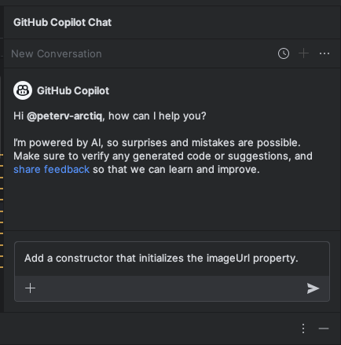
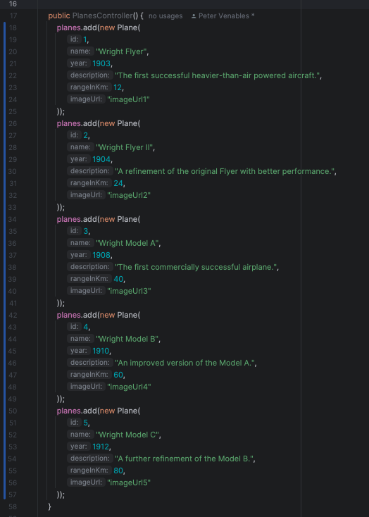
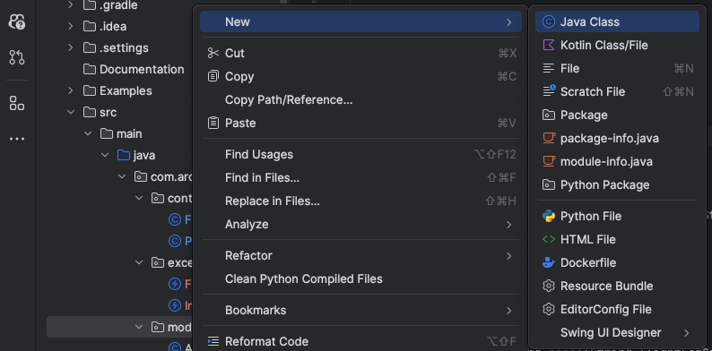

# Lab 2.2 - Navigating the Code Clouds: Advanced Features of GitHub Copilot

This lab exercise delves into GitHub Copilot's advanced features, teaching participants to enhance coding efficiency through complex tasks like adding new properties, generating documentation, refactoring code, and parsing strings, supplemented by optional labs on context understanding and regex parsing.

## Prerequisites
- The prerequisites steps must be completed, see [Labs Prerequisites](../Lab%201.1%20-%20Pre-Flight%20Checklist/README.md)

## Estimated time to complete

- 30 minutes, times may vary with optional labs.

## Objectives

- To master GitHub Copilot's advanced features for solving complex coding exercises and optimizing code.
    - Step 1 - The Complete Wright Brothers Fleet - More than one thing at a time
    - Step 2 - Flight Logbook - Logging Your Coding Journey
    - Step 3 - Flying in Formation - Code Refactoring
    - Step 4 - Parsing Flight Show - Prompt Engineering

### Step 1: - The Complete Wright Brothers Fleet - More than one thing at a time

- Open the `Plane.ts` file located in the `Models` folder.

- Add a `imageUrl` property to the model.

- Type `public imageUrl: string;` in the `Plane.cs` file.

    ```typescript
    class Plane {
        public id: number;
        public name: string;
        public year: number;
        public description: string;
        public rangeInKm: number;

        // New property
        public imageUrl: string;

        /* Other methods */
    }
    ```

- Select the `imageUrl` property and the constructor method below it, then press `Ctrl/Cmd + I` to bring up the inline chat prompt.

- Type `Add a constructor that initializes the imageUrl property.` in the chat prompt.

    

- Copilot will suggest a new constructor method that initializes the `imageUrl` property.

    ```typescript
    constructor(id: number, name: string, year: number, description: string, rangeInKm: number, imageUrl: string) {
        this.id = id;
        this.name = name;
        this.year = year;
        this.description = description;
        this.rangeInKm = rangeInKm;
        this.imageUrl = imageUrl;
    }
    ```

- Accept the suggestion by selecting `Accept` or pressing `Ctrl/Cmd + Enter`.

- Open the `Controllers/PlanesController.ts` file.

- Select all items of the `Planes` List, then press `Ctrl/Cmd + I` to bring up the inline chat prompt.

- Type the following command

    ```
    Add the new ImageUrl property to each plane and add the next 2 additional planes to complete the Wright Brothers Fleet.
    ```

    

- Accept the suggestion by selecting `Accept` or pressing `Ctrl/Cmd + Enter`.

> [!NOTE]
> GitHub Copilot can do more than one thing at a time. It added the new property to each plane and next Wright Brothers plane to the list of planes.  

### Step 2: - Flight Logbook - Logging Your Coding Journey

- Open the `PlanesController.ts` file.

- Select all content of the method `GetById` in the `PlanesController.ts` file, then press `Ctrl/Cmd + I` to bring up the inline chat prompt. Type `/doc` in the chat prompt.

    

- Do not accept the suggestion, click `Discard`.

> [!NOTE]
> GitHub Copilot used the `/doc` agent to generate the documentation for a single method or the entire file in a matter of seconds. This is a great way to document your codebase quickly and efficiently. However, we will use the in editor Chat to document the code in a more controlled way.

- Let's try this using a different approach, select all content of the method `GetById` in the `PlanesController.ts` file.

    

- Open GitHub Copilot Chat, click **+** to clear prompt history, then type the following command:

1) Simple:

    ```
    Document all my code
    ```

2) More details using JSDoc method documentation

    ```
    document all my code with details using JSDoc method documentation
    ```

- Review the documentation to ensure it's accurate, then click on `Insert at cursor` to replace the `PlanesController.ts` method with the new documentation.

> [!NOTE]
> The difference is that in editor Chat does light documentation vs GitHub Copilot window does a thorough job documenting every important section of code.

### Step 3: - Flying in Formation - Code Refactoring

- Open the `Controllers/FlightsController.ts` file.

- Navigate to the `UpdateFlightStatus` method.

    ```typescript
    class FlightsController {
        /* Other methods */

        updateStatus(req: Request, res: Response) {
            const id = parseInt(req.params.id);
            const newStatus = req.body.status;
            const flight = this.flights.find(f => f.id === id);
            if (flight) {
                switch (newStatus) {
                    case 'Boarding':
                        if (new Date() > flight.departureTime) {
                            return { status: 400, message: "Cannot board, past departure time." };
                        }
                        break;
                    case 'Departed':
                        if (flight.status !== 'Boarding') {
                            return { status: 400, message: "Flight must be in 'Boarding' status before it can be 'Departed'." };
                        }
                        break;
                    case 'InAir':
                        if (flight.status !== 'Departed') {
                            return { status: 400, message: "Flight must be in 'Departed' status before it can be 'In Air'." };
                        }
                        break;
                    case 'Landed':
                        if (flight.status !== 'InAir') {
                            return { status: 400, message: "Flight must be in 'In Air' status before it can be 'Landed'." };
                        }
                        break;
                    case 'Cancelled':
                        if (new Date() > flight.departureTime) {
                            return { status: 400, message: "Cannot cancel, past departure time." };
                        }
                        break;
                    case 'Delayed':
                        if (flight.status === 'Cancelled') {
                            return { status: 400, message: "Cannot delay, flight is cancelled." };
                        }
                        break;
                    default:
                        return { status: 400, message: "Unknown or unsupported flight status." };
                }
        
                flight.status = newStatus;
        
                return { status: 200, message: `Flight status updated to ${newStatus}.` };
            } else {
                return { status: 404, message: "Flight not found." };
            }
        }
    }
    ```

> [!NOTE]
> Note that the `UpdateFlightStatus` method has a high code complexity rating of 13, calculated by the [Cyclomatic Complexity metric](https://en.wikipedia.org/wiki/Cyclomatic_complexity). This is a good candidate for refactoring.

- Select all the content of the `UpdateFlightStatus` method.

- Open GitHub Copilot Chat, click **+** to clear prompt history.

- Ask the following question:

  ```
  Refactor the selected code to make it more readable and maintainable.
  ```

  

> [!NOTE]
> GitHub Copilot Chat understands `the selected code`. It will use the selected code in your editor to generate the refactoring suggestions.

- GitHub Copilot Chat suggests a code improvement to extract some of the complex code to their own methods to make the code more readible and maintainable:

    ```typescript
    updateStatus(req: Request, res: Response) {
        const id = parseInt(req.params.id);
        const newStatus = req.body.status;
        const flight = this.flights.find(f => f.id === id);

        if (!flight) {
            return { status: 404, message: "Flight not found." };
        }

        const statusUpdateFunctions = {
            'Boarding': this.updateToBoarding,
            'Departed': this.updateToDeparted,
            'InAir': this.updateToInAir,
            'Landed': this.updateToLanded,
            'Cancelled': this.updateToCancelled,
            'Delayed': this.updateToDelayed
        };

        const updateFunction = statusUpdateFunctions[newStatus];

        if (!updateFunction) {
            return { status: 400, message: "Unknown or unsupported flight status." };
        }

        const result = updateFunction(flight);

        if (result.error) {
            return { status: 400, message: result.message };
        }

        flight.status = newStatus;

        return { status: 200, message: `Flight status updated to ${newStatus}.` };
    }

    updateToBoarding(flight) {
        if (new Date() > flight.departureTime) {
            return { error: true, message: "Cannot board, past departure time." };
        }
        return { error: false };
    }

    updateToDeparted(flight) {
        if (flight.status !== 'Boarding') {
            return { error: true, message: "Flight must be in 'Boarding' status before it can be 'Departed'." };
        }
        return { error: false };
    }

    updateToInAir(flight) {
        if (flight.status !== 'Departed') {
            return { error: true, message: "Flight must be in 'Departed' status before it can be 'In Air'." };
        }
        return { error: false };
    }

    updateToLanded(flight) {
        if (flight.status !== 'InAir') {
            return { error: true, message: "Flight must be in 'In Air' status before it can be 'Landed'." };
        }
        return { error: false };
    }

    updateToCancelled(flight) {
        if (new Date() > flight.departureTime) {
            return { error: true, message: "Cannot cancel, past departure time." };
        }
        return { error: false };
    }

    updateToDelayed(flight) {
        if (flight.status === 'Cancelled') {
            return { error: true, message: "Cannot delay, flight is cancelled." };
        }
        return { error: false };
    }
    ```
> [!NOTE]
> The output of GitHub Copilot Chat can vary, but the output should be a refactored method that is more readable and maintainable.

> [!NOTE]
> GitHub Copilot Chat can make mistakes sometimes. Best practice is to have the method covered with unit tests before refactoring it. This is not a requirement for this lab, but it is a good practice to follow. These unit tests can be generated by GitHub Copilot as well.

### Step 4: - Parsing Flight Show - Prompt Engineering

- Open the `Models/Flight.ts` file.

- Take a look at the `flightLogSignature` property.

    ```typescript
    class Flight {
        // Other properties
        // ...

        public flightLogSignature: string;
    }
    ```

- Open GitHub Copilot Chat, click **+** to clear prompt history, then ask the following question:

```
Create a Typescript class for a flightLogSignature property.

Example: 17121903-DEP-ARR-WB001

17th of December 1903
Departure from Kitty Hawk, NC
Arrival at Manteo, NC
Flight number WB001

## Technical Requirements
- Create a FlightLog class
- Add a Parse method that returns a FlightLog object
- Include import at the top of the file
- Include export at the bottom of the file
```

- The prompt contains a few-shot prompting example of a `flightLogSignature` and a few technical requirements.

> [!NOTE]
> Few-Shot prompting is a concept of prompt engineering. In the prompt you provide a demonstration of the solution. In this case we provide examples of the input and also requirements for the output. This is a good way to instruct Copilot to generate specific solutions.

- Take a look at the following link to learn more about few-shot prompting: https://www.promptingguide.ai/techniques/fewshot

- Copilot will suggest a new `flightLog` record type and a `Parse` method. The `Parse` method splits the string and assigns each part to a corresponding property.

    ```typescript
    class FlightLog {
        date: Date;
        departure: string;
        arrival: string;
        flightNumber: string;

        constructor(date: Date, departure: string, arrival: string, flightNumber: string) {
            this.date = date;
            this.departure = departure;
            this.arrival = arrival;
            this.flightNumber = flightNumber;
        }

        static parse(flightLogSignature: string): FlightLog {
            const [date, departure, arrival, flightNumber] = flightLogSignature.split('-');
            const parsedDate = new Date(parseInt(date.slice(0, 2)), parseInt(date.slice(2, 4)) - 1, parseInt(date.slice(4)));

            return new FlightLog(parsedDate, departure, arrival, flightNumber);
        }
    }

    export { FlightLog };
    ```

> [!NOTE]
> GitHub Copilot is very good at understanding the context of the code. From the prompt we gave it, it understood that the `flightLogSignature` is a string in a specific format and that it can be parsed into a `flightLogSignature` model, to make the code more readable and maintainable.

- In GitHub Copilot Chat, click the ellipses `...` and select `Insert into New File` for the suggested `FlightLog` record as `Models/FlightLog.ts`.

    

> [!NOTE]
> GitHub Copilot has many quick actions that can be used to speed up the development process. In this case, it created a new file based on the code suggestions. 

- Copilot will add the code to a new empty file, but must be saved.

- Save the file by clicking pressing `Ctrl + S` or `Cmd + S`.

- Navigate to folder `/WrightBrothersApi/Models` and save the file as `FlightLog.ts`.

- Now, let's add the new `FlightLog` property to the `Flight` model.

- Open the `Models/Flight.ts` file.

- Add the `flightLog` property to the `Flight` model, by typing `public fli`
    
    ```typescript
    class Flight {
        // Other properties
        // ...

        // Existing property
        public flightLogSignature: string;

        // New property
        public fli <---- Place cursor here
    }
    ```

- Copilot will suggest the following code:

    ```typescript
    class Flight {
        // Other properties
        // ...

        // Existing property
        public flightLogSignature: string;

        // New property
        public flightLog: FlightLog;
    }
    ```

- Accept the suggestion by selecting `Accept` or pressing `Ctrl/Cmd + Enter`.

- Add the `flightLog` property to the constructor of the `Flight` model, by typing `this.fli`

    ```typescript
    class Flight {
        // Other properties
        // ...

        // Existing property
        public flightLogSignature: string;

        // New property
        public flightLog: FlightLog;

        constructor(flightLogSignature: string) {
            this.flightLogSignature = flightLogSignature;
            this.fli <---- Place cursor here
        }
    }
    ```

- Copilot will suggest the following code:

    ```typescript
    class Flight {
        // Other properties
        // ...

        // Existing property
        public flightLogSignature: string;

        // New property
        public flightLog: FlightLog;

        constructor(flightLogSignature: string) {
            this.flightLogSignature = flightLogSignature;
            this.flightLog = FlightLog.parse(flightLogSignature);
        }
    }
    ```

- Accept the suggestion by selecting `Accept` or pressing `Ctrl/Cmd + Enter`.

> [!NOTE]
> Copilot used the newly created `FlightLog.ts` file in in its context and suggested the `FlightLog.parse` method.

- Run the application by typing the following commands in the terminal:

    ```sh
    npm run build && npm start
    ```

> [!NOTE]
> If you encounter an error message like `Could not read package.json`, it's likely that you're executing the command from an incorrect directory. To resolve this, navigate to the correct directory using the command `cd ./WrightBrothersApi`. If you need to move one level up in the directory structure, use the command `cd ..`. The corrcect directory is the one that contains the `package.json` file.

- Open `WrightBrothersApi/Examples/Flights.http` file in the Visual Studio code IDE and POST a new flight.

    

- Click the `Send Request` button for the `POST` below:

    ```json
    POST http://localhost:3000/flights HTTP/1.1
    ```

- The Rest Client response will now include the `FlightLog` property as follows:

    ```json
    HTTP/1.1 201 Created
    Connection: close
    {
        "id": 4,
        "flightLogSignature": "17091908-DEP-ARR-WB004",
        "flightLog": {
            "date": "1908-09-17T00:00:00",
            "departure": "DEP",
            "arrival": "ARR",
            "flightNumber": "WB004"
        },
    }
    ```

- Note the `flightLog` property that is parsed based on the ` flightLogSignature`

- Stop the app by pressing `Ctrl + C` or `Cmd + C` in the terminal.

### Congratulations you've made it to the end! &#9992; &#9992; &#9992;

#### And with that, you've now concluded this module. We hope you enjoyed it! &#x1F60A;
