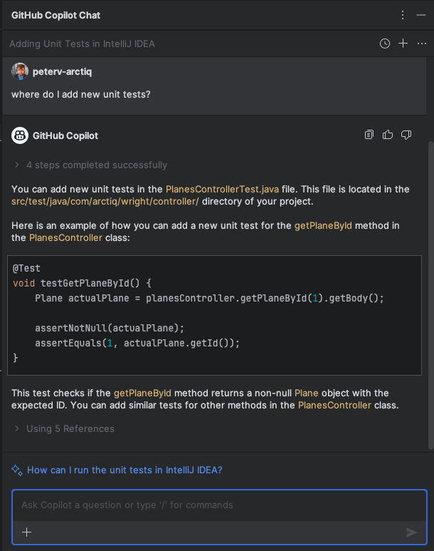
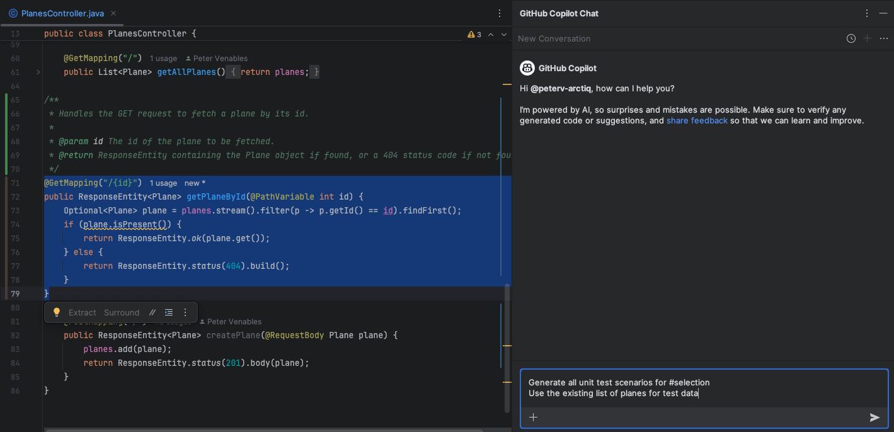
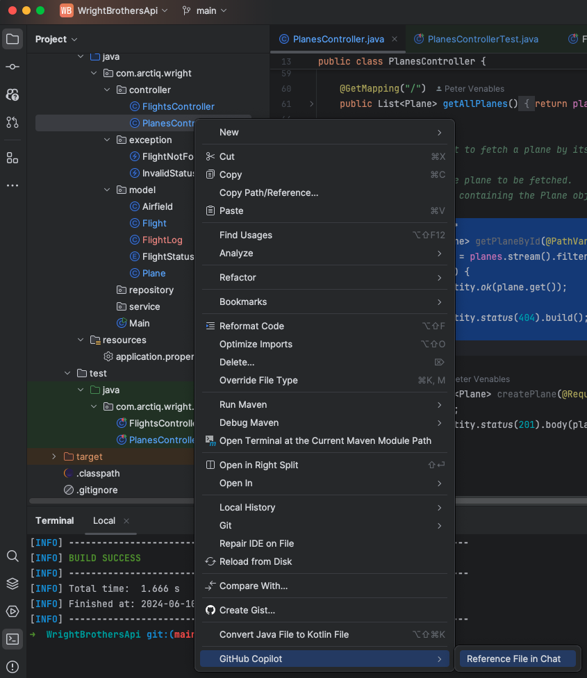
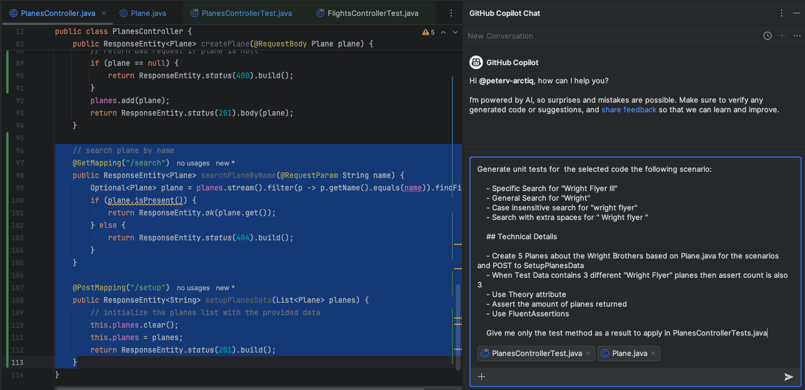
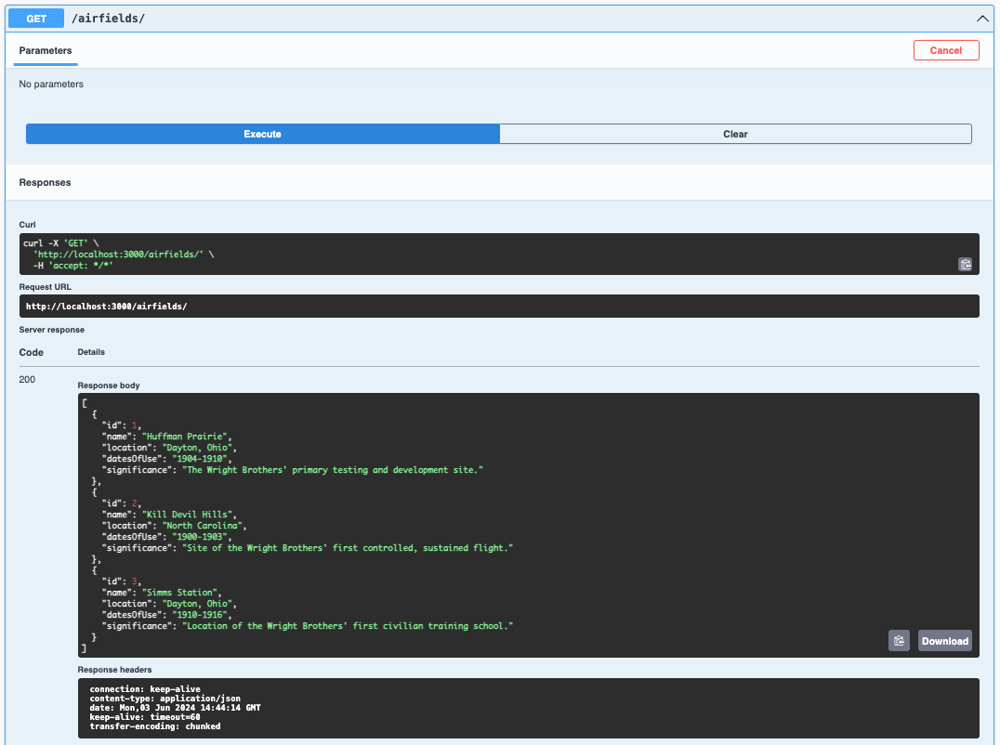

# Lab 2.2 - Taking Off with Code: Clearing the Runway

This lab exercise guides participants through coding exercises using GitHub Copilot to understand its suggestions and capabilities. It involves running and adding unit tests, with an emphasis on pair programming. The lab is structured in steps, starting with executing existing unit tests, followed by enhancing test coverage, and addressing specific functionalities like case sensitivity and trimming in search methods.

## Prerequisites

- The prerequisites steps must be completed, see [Labs Prerequisites](../Lab%201.1%20-%20Pre-Flight%20Checklist/README.md)

## Estimated time to complete

- 20 minutes, times may vary with optional labs.

## Objectives

- Simple coding exercises using GitHub Copilot, focusing on understanding its suggestions and capabilities.
- Pair programming: One 'pilot' codes, the other guides using Copilot's suggestions.

  - Step 1 - Taxiing to the Runway - Run existing unit tests
  - Step 2 - Pre-takeoff Pilot Checks - Completing Unit Tests
  - Step 3 - Takeoff - Adding Unit Tests for Case Sensitivity (Optional)
  - Step 4 - Ascending to the Clouds: Creating the AirfieldController from thin air (Optional)

### Step 1: Taxying to the Runway - Run existing unit tests

- Open GitHub Copilot Chat, click **+** to clear prompt history.

- Type the following in the chat window:

    ```md
    how do I run the unit tests?
    ```

- Copilot will give a suggestion to run the unit tests in the terminal.

    ```sh
    mvn test
    ```

    Although it will also indicate that gradle can be used.

- Let's run the unit tests in the terminal to make sure everything is working as expected.

- Open the terminal and run the tests with the provided command.

    ```sh
    mvn test
    ```

- The tests should run and pass.

    ```sh
    ...
    [INFO] -------------------------------------------------------
    [INFO]  T E S T S
    [INFO] -------------------------------------------------------
    [INFO] Running com.arctiq.wright.FlightsControllerTest
    [INFO] Tests run: 1, Failures: 0, Errors: 0, Skipped: 0, Time elapsed: 0.127 s -- in com.arctiq.wright.FlightsControllerTest
    [INFO] 
    [INFO] Results:
    [INFO] 
    [INFO] Tests run: 1, Failures: 0, Errors: 0, Skipped: 0
    [INFO] 
    [INFO] ------------------------------------------------------------------------
    [INFO] BUILD SUCCESS
    [INFO] ------------------------------------------------------------------------
    [INFO] Total time:  2.463 s
    [INFO] Finished at: 2024-06-10T12:01:51-04:00
    [INFO] ------------------------------------------------------------------------
    ```

> [!NOTE]
> Only the results section of the test output was included above for brevity.

### Step 2: Pre-takeoff Pilot Checks - Completing Unit Tests

- Open GitHub Copilot Chat, click **+** to clear prompt history.

- Type the following in the chat window:

    ```md
    Where do I add additional unit tests?
    ```

- Copilot will explain that java tests are usually located in a parallel directory structure to the main package code as `src/test/java` and mirrors the structure of the main package in `src/main/java`.

- Copilot will additionally give you a suggested structure for a unit test.

- You can add additional unit tests in the `PlanesControllerTest` class in the `src/test/java/com/arctiq/wright/controller/PlaneControllerTest.java` file.



- Open Copilot Chat and Copy/Paste the following

    ```md
    Generate all unit test scenarios for #selection
    Use the existing list of planes for test data
    ```



- For `#selection`, open the `PlanesController.java` file.

- Select all the code for the `GetById` method.

- Press `Enter`, GitHub Copilot will automatically suggest the unit tests attributes.

- The problem is that the generated test methods do not match with the style of the existing test methods in the `PlanesControllerTests.cs` file.

- Let's fix this. Open Copilot Chat and Copy/Paste the following and place your cursor after `tests should match`:

    ```md
    Generate all unit test scenarios for #selection and the tests should match the style in PlanesController.java
    Use the existing list of planes for test data
    ```

> [!NOTE]
> The VSCode version of this step refers to #file to dynamically link a file to the Copilot chat inline. IntelliJ does not have this capability. It can, however, detect the file named or can be explicitly included in the chat using the Right-click menu on the PlanesController.java file and selecting `GitHub Copilot` and `Reference File in Chat`



- If you did this, you can modify your original prompt as follows:

    ```md
    Generate all unit test scenarios for #selection and the tests should match the style in the referenced file
    Use the existing list of planes for test data
    ```

- Now submit the prompt by pressing Enter.

- Copilot will give a suggestion to generate all unit test scenarios for the `GetPlaneById` method.

    ```java
    @Test
    void testGetPlaneByIdExists() {
        ResponseEntity<Plane> response = planesController.getPlaneById(1);

        assertNotNull(response.getBody());
        assertEquals(1, response.getBody().getId());
        assertEquals(200, response.getStatusCode().value());
    }

    @Test
    void testGetPlaneByIdNotExists() {
        ResponseEntity<Plane> response = planesController.getPlaneById(999);

        assertNull(response.getBody());
        assertEquals(404, response.getStatusCode().value());
    }
    ```

> [!NOTE]
> Copilot generated two unit tests for the `GetPlaneById` method. The first test checks if the method returns a plane when the id exists. The second test checks if the method returns a `NotFound` result when the id does not exist. It also matches how the unit tests are structured in the `PlanesControllerTests.java` file.

> [!NOTE]
> Creating unit tests works best when the scope is limited to a single method. You can then use `#file` to make sure it creates unit tests that is in line with the existing unit tests.

- Now Open `PlanesControllerTests.java` and Place your cursor at the end of the file, after the `}` of the `testGetAllPlanes()` method.

```java
class PlanesControllerTest {

    private PlanesController planesController;

    @BeforeEach
    void setUp() {
        planesController = new PlanesController();
    }

    @Test
    void testGetAllPlanes() {
        List<Plane> actualPlanes = planesController.getAllPlanes();

        assertFalse(actualPlanes.isEmpty());
    }

    <---- Place your cursor here

    // Add more test methods here for other methods in the PlanesController class
}
```

- In GitHub Copilot Chat, click the `Insert at Cursor` button for the suggested unit test methods.

- Let's test the newly added tests by opening the terminal and run the tests with the provided command.

    ```sh
    mvn test
    ```

> [!NOTE]
> Some tests might still fail. Copilot does not always provide the correct suggestions. It's important to understand the suggestions and do some extra work to make sure the tests are correct. Copilot can help you with that as well.

- The tests should run and pass.

    ```md
    [INFO] Results:
    [INFO] 
    [INFO] Tests run: 4, Failures: 0, Errors: 0, Skipped: 0
    ```

## Optional

### Step 3: Taking Off - Developing Robust Tests

- Open the `PlanesController.java` file.

- Make sure to add the `searchPlaneByName` method to the `PlanesController.java` file if you haven't already in the previous lab. If not, use the following code snippet to add the method at bottom of the file.

    ```java
    @GetMapping("/search")
    public ResponseEntity<Plane> searchPlaneByName(@RequestParam String name) {
        Optional<Plane> plane = planes.stream().filter(p -> p.getName().equals(name)).findFirst();
        if (plane.isPresent()) {
            return ResponseEntity.ok(plane.get());
        } else {
            return ResponseEntity.status(404).build();
        }
    }
    ```

- Also, add the following method at the bottom of file to setup data for the tests we are about to create.

    ```java
    @PostMapping("/setup")
    public ResponseEntity<String> setupPlanesData(List<Plane> planes) {
        // initialize the planes list with the provided data
        this.planes.clear();
        this.planes = planes;
        return ResponseEntity.status(201).build();
    }
    ```

> [!NOTE]
> Setting up data like this is not recommended in a production environment. It's better to use a database or a mock database for this purpose. For the sake of this lab, we are using this approach.

- In the following exercise you will combine everything you learned in the previous steps, but then for the `SearchByName` method. The following prompt is a more detailed description of a problem and the expected solution. You will prompt GitHub Copilot to make it use a `#selection`. besides that you will use `#file` two times in the prompt to make sure Copilot knows the context of the problem.

- Open GitHub Copilot Chat, click **+** to clear prompt history.

- Copy/Paste the following in the Copilot Chat window:

    ```md
    Generate unit tests for #selection the following scenario:

    - Specific Search for "Wright Flyer III"
    - General Search for "Wright"
    - Case insensitive search for "wright flyer"
    - Search with extra spaces for " Wright flyer "

    ## Technical Details

    - Create 5 Planes about the Wright Brothers based on #file:Plane.cs for the scenarios and POST to SetupPlanesData
    - When Test Data contains 3 different "Wright Flyer" planes then assert count is also 3
    - Use Theory attribute
    - Assert the amount of planes returned
    - Use FluentAssertions

    Give me only the test method as a result to apply in #file:PlanesControllerTests.cs
    ```



- For the selection, select the following two methods in the `PlanesController.java` class.
- If you don't have these two methods adjacent, do that first.

    ```java
    @GetMapping("/search")
    public ResponseEntity<Plane> searchPlaneByName(@RequestParam String name) {
        Optional<Plane> plane = planes.stream().filter(p -> p.getName().equals(name)).findFirst();
        if (plane.isPresent()) {
            return ResponseEntity.ok(plane.get());
        } else {
            return ResponseEntity.status(404).body(new ArrayList<>());
        }
    }

    @PostMapping("/setup")
    public ResponseEntity<String> setupPlanesData(List<Plane> planes) {
        // initialize the planes list with the provided data
        this.planes.clear();
        this.planes = planes;
        return ResponseEntity.status(201).build();
    }
    ```

- It is a good idea to add the two files referenced in the prompt using the `GitHub Copilot` -> `Reference File in Chat`.

> [!NOTE]
> This example shows how `#file` is used in a way how a human might approach a problem. You can include context at any time to help Copilot understand the problem or solution better.

- Open Copilot Chat and Copy/Paste the prompt.

- Submit the prompt by pressing Enter.

- Copilot will then give the following suggestion to generate unit tests for the `SearchByName` method.

    ```java
    @ParameterizedTest
    @MethodSource("provideSearchTerms")
    void testSearchPlaneByName(String searchTerm, int expectedCount) {
        // Setup test data
        List<Plane> planes = List.of(
                new Plane(1, "Wright Flyer", 1903, "Description", 12, "imageUrl1"),
                new Plane(2, "Wright Flyer II", 1904, "Description", 24, "imageUrl2"),
                new Plane(3, "Wright Flyer III", 1908, "Description", 40, "imageUrl3"),
                new Plane(4, "Wright Model A", 1910, "Description", 60, "imageUrl4"),
                new Plane(5, "Wright Model B", 1912, "Description", 80, "imageUrl5")
        );
        ResponseEntity<String> setupResponse = planesController.setupPlanesData(planes);
        assertEquals(HttpStatus.CREATED, setupResponse.getStatusCode());

        // Perform search
        ResponseEntity<Plane> response = planesController.searchPlaneByName(searchTerm);

        // Assert the amount of planes returned
        assertEquals(searchTerm.toLowerCase(), response.getBody().getName().toLowerCase());
        assertEquals(HttpStatus.OK, response.getStatusCode());
    }

    private static Stream<Arguments> provideSearchTerms() {
        return Stream.of(
                Arguments.of("Wright Flyer III", 1),
                Arguments.of("Wright", 5),
                Arguments.of("wright flyer", 3),
                Arguments.of(" Wright flyer ", 3)
        );
    }
    ```

- Open the `PlanesControllerTests.java` file

- Place your cursor at the end of the file, after the last unit test `}`.

    ```java
    class PlanesControllerTest {
        /* Rest of the methods */

        <---- Place your cursor here
    }
    ```

- In GitHub Copilot Chat, click the `Insert at Cursor` button for the suggested unit test methods.

> [!NOTE]
> If the generated code includes copies of lines in your existing test class, select, copy, and paste only the parts you need.

> [!NOTE]
> You may need to copy import statements and download additional jars depending on the code generated.

- Let's run the unit tests in the terminal:

    ```sh
    mvn test
    ```

- Not all tests will pass. For example the `Case insensitive` and `Extra spaces` test will fail. This is because the `SearchByName` method is case sensitive. Let's fix this.

> ![Note] It could happen that Copilot already made the method case insensitve during creation. You can then continue with the next task as still some tests cases will fail.

```md
[ERROR] Tests run: 8, Failures: 3, Errors: 0, Skipped: 0
```

- Let's now use the generated tests as a guide to fix the case sensitivity issue.

- Open GitHub Copilot Chat, click **+** to clear prompt history.

- Copy/Paste the following in the chat window:

```md
fix selected method based on tests PlaneControllerTests.java
```

- Open `PlanesController.java` file.

- For the selection code, select the `SearchByName` method in the `PlanesController.java` file.

```java
    @GetMapping("/search")
    public ResponseEntity<Plane> searchPlaneByName(@RequestParam String name) {
        Optional<Plane> plane = planes.stream().filter(p -> p.getName().equals(name)).findFirst();
        if (plane.isPresent()) {
            return ResponseEntity.ok(plane.get());
        } else {
            return ResponseEntity.status(404).body(new ArrayList<>());
        }
    }
```

- Submit the prompt by pressing Enter.

- to which Copilot should recommend something like this:

```java
    @GetMapping("/search")
    public ResponseEntity<List<Plane>> searchPlaneByName(@RequestParam String name) {
        List<Plane> matchingPlanes = planes.stream()
            .filter(p -> p.getName().toLowerCase().contains(name.toLowerCase()))
            .collect(Collectors.toList());
        if (!matchingPlanes.isEmpty()) {
            return ResponseEntity.ok(matchingPlanes);
        } else {
            return ResponseEntity.status(404).body(new ArrayList<>());
        }
    }
```

- Apply the changes to the `PlanesController.java` file.

- Click on the `Insert at cursor` to replace the `SearchByName` method with the new one.

- Open the terminal and run the tests with the provided command

    ```sh
    mvn test
    ```

- The tests should run and pass.

```sh
[INFO] Results:
[INFO] 
[INFO] Tests run: 8, Failures: 0, Errors: 0, Skipped: 0
```

> [!NOTE]
> If all tests pass, you have successfully completed this step. If not, you will need to debug the tests. GitHub Copilot got you started, but you, the Pilot, must take charge to diagnose and fix the discrepancies.

## Optional

### Step 4: Laying Down the Runway - Creating the AirfieldController from thin air (Optional)

- Open the `WrightBrothersApi` folder in Visual Studio Code.

- Open the `src/main/java/com/arctiq/wright/model/Airfield.java` file.

- Open GitHub Copilot Chat, click **+** to clear prompt history.

- Ask the following question:

    ```md
    Using the Airfield class, create a new ApiController class with all the CRUD operations and add test data for the first 3 airfields used by the Wright Brothers as well as the router with all the routing handlers attached.
    ```

- Copilot will give a suggestion to create an `AirfieldController` class based on the `Airfield` class.

    ```java
    package com.arctiq.wright.controller;

    import org.springframework.http.ResponseEntity;
    import org.springframework.web.bind.annotation.*;
    import java.util.ArrayList;
    import java.util.List;
    import java.util.Optional;
    import com.arctiq.wright.model.Airfield;

    @RestController
    @RequestMapping("/airfields")
    public class AirfieldController {

        private List<Airfield> airfields = new ArrayList<>();

        public AirfieldController() {
            airfields.add(new Airfield(1, "Huffman Prairie", "Dayton, Ohio", "1904-1910", "The Wright Brothers' primary testing and development site."));
            airfields.add(new Airfield(2, "Kill Devil Hills", "North Carolina", "1900-1903", "Site of the Wright Brothers' first controlled, sustained flight."));
            airfields.add(new Airfield(3, "Simms Station", "Dayton, Ohio", "1910-1916", "Location of the Wright Brothers' first civilian training school."));
        }

        @GetMapping("/")
        public List<Airfield> getAllAirfields() {
            return airfields;
        }

        @GetMapping("/{id}")
        public ResponseEntity<Airfield> getAirfieldById(@PathVariable int id) {
            Optional<Airfield> airfield = airfields.stream().filter(a -> a.getId() == id).findFirst();
            if (airfield.isPresent()) {
                return ResponseEntity.ok(airfield.get());
            } else {
                return ResponseEntity.status(404).build();
            }
        }

        @PostMapping("/")
        public ResponseEntity<Airfield> createAirfield(@RequestBody Airfield airfield) {
            Optional<Airfield> existingAirfield = airfields.stream().filter(a -> a.getId() == airfield.getId()).findFirst();
            if (existingAirfield.isPresent()) {
                return ResponseEntity.status(409).body(airfield);
            } else {
                airfields.add(airfield);
                return ResponseEntity.status(201).body(airfield);
            }
        }

        @PutMapping("/{id}")
        public ResponseEntity<Airfield> updateAirfield(@PathVariable int id, @RequestBody Airfield airfield) {
            Optional<Airfield> existingAirfield = airfields.stream().filter(a -> a.getId() == id).findFirst();
            if (existingAirfield.isPresent()) {
                Airfield updatedAirfield = existingAirfield.get();
                updatedAirfield.setName(airfield.getName());
                updatedAirfield.setLocation(airfield.getLocation());
                updatedAirfield.setDatesOfUse(airfield.getDatesOfUse());
                updatedAirfield.setSignificance(airfield.getSignificance());
                return ResponseEntity.ok(updatedAirfield);
            } else {
                return ResponseEntity.status(404).build();
            }
        }

        @DeleteMapping("/{id}")
        public ResponseEntity<Void> deleteAirfield(@PathVariable int id) {
            Optional<Airfield> airfield = airfields.stream().filter(a -> a.getId() == id).findFirst();
            if (airfield.isPresent()) {
                airfields.remove(airfield.get());
                return ResponseEntity.noContent().build();
            } else {
                return ResponseEntity.status(404).build();
            }
        }
    }
    ```

- Create a new class file called AirfieldController.java in the java/com/arctiq/wright/controller folder. 
- In GitHub Copilot Chat, click the "Insert Code Block at cursor" with the new class file open (ensure the default contents are cleared or highlighted first.)
- Save the file by clicking pressing `Ctrl + S` or `Cmd + S`.

> [!NOTE]
> Copilot is not only context aware, knows you need a list of items and knows the `Air Fields` used by the Wright Brothers, the `Huffman Prairie`, which is the first one used by the Wright Brothers.

- Now that you have created the `AirfieldController` with CRUD operations, it's time to check that it's working as expected.

- Run the application by typing the following commands in the terminal:

    ```sh
    mvn spring-boot:run 
    ```

- Open the browser to `http://localhost:3000/swagger-ui/index.html` 
- Find the `airfiled-controller` group of actions.
- Expand the '`GET /airfields/` action.
- Click the `Try it out` button on the right side of this action.
- Click `Execute` to get all of the airfields.

- You will see that the list of airfields (likely) includes three airfields as:
  - Huffman Prairie
  - Kill Devil Hill
  - Simms Station

- Response will look like:



- Stop the application by pressing `Ctrl+C` in the terminal window.

### Congratulations you've made it to the end! &#9992; &#9992; &#9992;

#### And with that, you've now concluded this module. We hope you enjoyed it! &#x1F60A;
