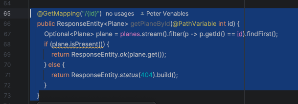
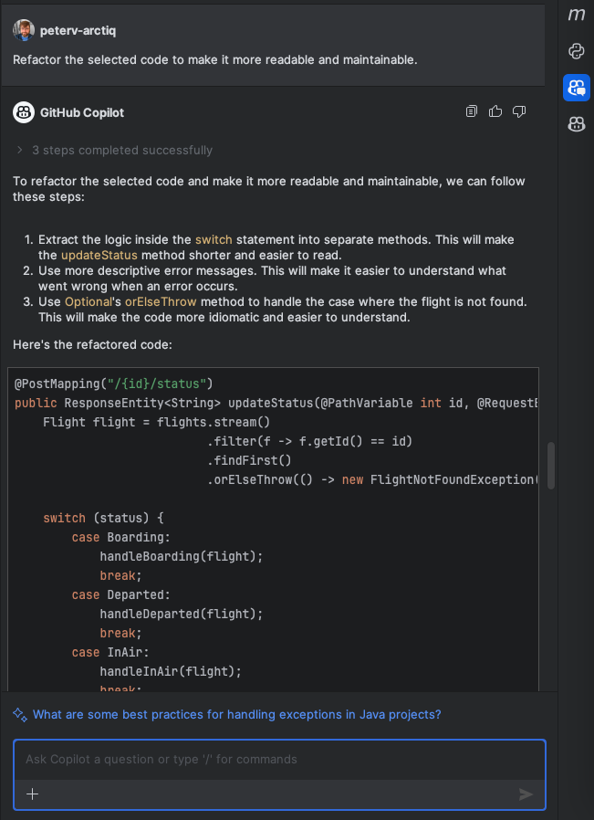
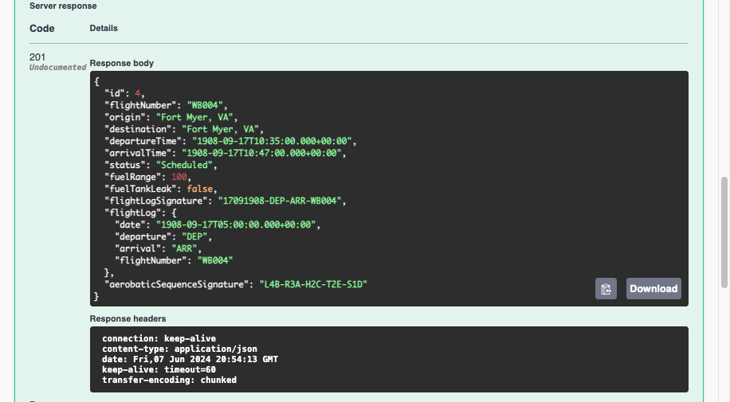

# Lab 2.2 - Navigating the Code Clouds: Advanced Features of GitHub Copilot

This lab exercise delves into GitHub Copilot's advanced features, teaching participants to enhance coding efficiency through complex tasks like adding new properties, generating documentation, refactoring code, and parsing strings, supplemented by optional labs on context understanding and regex parsing.

## Prerequisites

- The prerequisites steps must be completed, see [Labs Prerequisites](../Lab%201.1%20-%20Pre-Flight%20Checklist/README.md)

## Estimated time to complete

- 30 minutes, times may vary with optional labs.

## Objectives

- To master GitHub Copilot's advanced features for solving complex coding exercises and optimizing code.
  - Step 1 - The Complete Wright Brothers Fleet - More than one thing at a time
  - Step 2 - Flight Logbook - Logging Your Coding Journey
  - Step 3 - Flying in Formation - Code Refactoring
  - Step 4 - Parsing Flight Show - Prompt Engineering

### Step 1: - The Complete Wright Brothers Fleet - More than one thing at a time

- Open the `Plane.java` file located in the `src/java/com/arctiq/wright/model` folder.

- Add an `imageUrl` property to the model.

- Type `private String imageUrl;` in the class member definition of the `Plane.java` file.

    ```java
    package com.arctiq.wright.model;

    public class Plane {
        private int id;
        private String name;
        private int year;
        private String description;
        private int rangeInKm;

        // New property
        private String imageUrl;

        /* Other methods */
        }
    ```

- Open the GitHub Copilot Chat agent window
- Select the `imageUrl` property and the constructor method below it, then press `Ctrl/Cmd + I` to bring up the inline chat prompt.

- Type `Add a constructor that initializes the imageUrl property.` in the chat prompt.

    

- Copilot will suggest a new constructor method that initializes the `imageUrl` property.

    ```java
    public Plane(int id, String name, int year, String description, int rangeInKm, String imageUrl) {
        this.id = id;
        this.name = name;
        this.year = year;
        this.description = description;
        this.rangeInKm = rangeInKm;
        this.imageUrl = imageUrl;
    }
    ```

- Accept the suggestion by copy and pasting the method into your class.

- Open the `PlanesContoller.java` file in the `src/java/com/arctiq/wright/controller` folder.

- Select all items of the `Planes` List, then type the following prompt into the Copilot Chat window.

    ```md
    Add the new ImageUrl property to each plane and add the next 2 additional planes to complete the Wright Brothers Fleet.
    ```

- Highlight the existing constructor method and click the `Insert code Block at Cursor` button on the Copilot Chat result window.

The resulting code inline should look like this:


> [!NOTE]
> GitHub Copilot can do more than one thing at a time. It added the new property to each plane and next Wright Brothers plane to the list of planes.

### Step 2: - Flight Logbook - Logging Your Coding Journey

- Open the `PlanesContoller.java` file in the `src/java/com/arctiq/wright/controller` folder.

- Select all content of the method `GetPlaneById` in the `PlanesController.java` file, then press `Ctrl/Cmd + I` to bring up the inline chat prompt. Type `/doc` in the chat prompt.



- Do not accept the suggestion, click `Discard`.

> [!NOTE]
> GitHub Copilot used the `/doc` agent to generate the documentation for a single method or the entire file in a matter of seconds. This is a great way to document your codebase quickly and efficiently. However, we will use the in editor Chat to document the code in a more controlled way.

- Let's try this using a different approach, select all content of the method `GetPlaneById` in the `PlanesController.java` file as before.

- Open GitHub Copilot Chat, click **+** to clear prompt history, then type the following command:

1) Simple:

    ```md
    Document this code.
    ```

> [!NOTE]
> IntelliJ selects a wider scope and context by default so we use the word 'this' to indicate the selected code segment. Otherwise, the IDE may choose to document our entire codebase here.

2) More details using JavaDoc method documentation

    ```md
    document this code with details using JavaDoc method documentation
    ```

The results here may not differ at all as Copilot will likely use JavaDoc by default. You can attempt to modify this output by suggesting a different documentation format, if applicable, in your environment.

- Review the documentation to ensure it's accurate, then click on `Insert at cursor` to replace the `GetPlaneByID` method in `PlanesController.java` new documentation.

### Step 3: - Flying in Formation - Code Refactoring

- Open the `FlightController.java` file in the `src/java/com/arctiq/wright/controller` folder.

- Navigate to the `UpdateStatus` method.

    ```java
    @RestController
    @RequestMapping("/flights")
    public class FlightsController {
        /* Other methods */

        @PostMapping("/{id}/status")
        public ResponseEntity<String> updateStatus(@PathVariable int id, @RequestBody FlightStatus status) {
            Optional<Flight> flight = flights.stream().filter(f -> f.getId() == id).findFirst();
            if (flight.isPresent()) {
                switch (status) {
                    case Boarding:
                        if (flight.get().getDepartureTime().before(new Date())) {
                            return ResponseEntity.status(400).body("Cannot board a flight that has already departed.");
                        }
                        break;
                    case Departed:
                        if (flight.get().getDepartureTime().after(new Date())) {
                            return ResponseEntity.status(400).body("Cannot depart a flight that has not yet boarded.");
                        }
                        if (flight.get().getStatus() == FlightStatus.Cancelled) {
                            return ResponseEntity.status(400).body("Cannot depart a cancelled flight.");
                        }
                        break;
                        // add a case for status "inAir"
                    case InAir:
                        if (flight.get().getDepartureTime().after(new Date())) {
                            return ResponseEntity.status(400).body("Cannot set a flight to inAir that has not yet departed.");
                        }
                        if (flight.get().getArrivalTime().before(new Date())) {
                            return ResponseEntity.status(400).body("Cannot set a flight to inAir that has already arrived.");
                        }
                        break;
                    case Arrived:
                        if (flight.get().getArrivalTime().after(new Date())) {
                            return ResponseEntity.status(400).body("Cannot arrive a flight that has not yet departed.");
                        }
                        break;
                    case Cancelled:
                        if (flight.get().getDepartureTime().before(new Date())) {
                            return ResponseEntity.status(400).body("Cannot cancel a flight that has already departed.");
                        }
                        break;

                }
                return ResponseEntity.status(200).body("Flight status updated.");
            } else {
                return ResponseEntity.status(404).build();
            }
        }
    }
    ```

> [!NOTE]
> Note that the `UpdateStatus` method has a high code complexity rating of 11, calculated by the [Cyclomatic Complexity metric](https://en.wikipedia.org/wiki/Cyclomatic_complexity). This is a good candidate for refactoring.

- Select all the content of the `UpdateStatus` method.

- Open GitHub Copilot Chat, click **+** to clear prompt history.

- Ask the following question:

  ```md
  Refactor the selected code to make it more readable and maintainable.
  ```



> [!NOTE]
> GitHub Copilot Chat understands `the selected code`. It will use the selected code in your editor to generate the refactoring suggestions.

- GitHub Copilot Chat suggests a code improvement to extract some of the complex code to their own methods to make the code more readible and maintainable:

    ```java
    @PostMapping("/{id}/status")
    public ResponseEntity<String> updateStatus(@PathVariable int id, @RequestBody FlightStatus status) {
        Flight flight = flights.stream()
                            .filter(f -> f.getId() == id)
                            .findFirst()
                            .orElseThrow(() -> new FlightNotFoundException("Flight with id " + id + " not found"));

        switch (status) {
            case Boarding:
                handleBoarding(flight);
                break;
            case Departed:
                handleDeparted(flight);
                break;
            case InAir:
                handleInAir(flight);
                break;
            case Arrived:
                handleArrived(flight);
                break;
            case Cancelled:
                handleCancelled(flight);
                break;
            default:
                throw new InvalidStatusException("Invalid status: " + status);
        }

        return ResponseEntity.status(200).body("Flight status updated.");
    }

    private void handleBoarding(Flight flight) {
        if (flight.getDepartureTime().before(new Date())) {
            throw new InvalidStatusException("Cannot board a flight that has already departed.");
        }
    }

    private void handleDeparted(Flight flight) {
        if (flight.getDepartureTime().after(new Date())) {
            throw new InvalidStatusException("Cannot depart a flight that has not yet boarded.");
        }
        if (flight.getStatus() == FlightStatus.Cancelled) {
            throw new InvalidStatusException("Cannot depart a cancelled flight.");
        }
    }

    private void handleInAir(Flight flight) {
        if (flight.getDepartureTime().after(new Date())) {
            throw new InvalidStatusException("Cannot set a flight to inAir that has not yet departed.");
        }
        if (flight.getArrivalTime().before(new Date())) {
            throw new InvalidStatusException("Cannot set a flight to inAir that has already arrived.");
        }
    }

    private void handleArrived(Flight flight) {
        if (flight.getArrivalTime().after(new Date())) {
            throw new InvalidStatusException("Cannot arrive a flight that has not yet departed.");
        }
    }

    private void handleCancelled(Flight flight) {
        if (flight.getDepartureTime().before(new Date())) {
            throw new InvalidStatusException("Cannot cancel a flight that has already departed.");
        }
    }
    ```

> [!NOTE]
> The output of GitHub Copilot Chat can vary, but the output should be a refactored method that is more readable and maintainable.

> [!NOTE]
> GitHub Copilot Chat can make mistakes sometimes. Best practice is to have the method covered with unit tests before refactoring it. This is not a requirement for this lab, but it is a good practice to follow. These unit tests can be generated by GitHub Copilot as well.

### Step 4: - Parsing Flight Show - Prompt Engineering

- Open the `Flight.java` file in the `src/java/com/arctiq/wright/model` folder.

- Take a look at the `flightLogSignature` property.

    ```java
    public class Flight {
        // other class attributes
        private String flightLogSignature;
        }
    ```

- Open GitHub Copilot Chat, click **+** to clear prompt history, then ask the following question:

```md
Create a Java class for a flightLogSignature property.

Example: 17121903-DEP-ARR-WB001

17th of December 1903
Departure from Kitty Hawk, NC
Arrival at Manteo, NC
Flight number WB001

## Technical Requirements
- Create a FlightLog class
- Add a Parse method that returns a FlightLog object
- Include import at the top of the file
- Include export at the bottom of the file
```

- The prompt contains a few-shot prompting example of a `flightLogSignature` and a few technical requirements.

> [!NOTE]
> Few-Shot prompting is a concept of prompt engineering. In the prompt you provide a demonstration of the solution. In this case we provide examples of the input and also requirements for the output. This is a good way to instruct Copilot to generate specific solutions.

- Take a look at the following link to learn more about few-shot prompting: https://www.promptingguide.ai/techniques/fewshot

- Copilot will suggest a new `flightLog` record type and a `Parse` method. The `Parse` method splits the string and assigns each part to a corresponding property.

    ```java
    package com.arctiq.wright.model;

    import java.text.ParseException;
    import java.text.SimpleDateFormat;
    import java.util.Date;

    public class FlightLog {
        private Date date;
        private String departure;
        private String arrival;
        private String flightNumber;

        public FlightLog(Date date, String departure, String arrival, String flightNumber) {
            this.date = date;
            this.departure = departure;
            this.arrival = arrival;
            this.flightNumber = flightNumber;
        }

        public static FlightLog parse(String flightLogSignature) throws ParseException {
            String[] parts = flightLogSignature.split("-");
            SimpleDateFormat formatter = new SimpleDateFormat("ddMMyyyy");
            Date date = formatter.parse(parts[0]);
            String departure = parts[1];
            String arrival = parts[2];
            String flightNumber = parts[3];

            return new FlightLog(date, departure, arrival, flightNumber);
        }

        // getters and setters
        public Date getDate() {
            return date;
        }

        public void setDate(Date date) {
            this.date = date;
        }

        public String getDeparture() {
            return departure;
        }

        public void setDeparture(String departure) {
            this.departure = departure;
        }

        public String getArrival() {
            return arrival;
        }

        public void setArrival(String arrival) {
            this.arrival = arrival;
        }

        public String getFlightNumber() {
            return flightNumber;
        }

        public void setFlightNumber(String flightNumber) {
            this.flightNumber = flightNumber;
        }
    }
    ```

> [!NOTE]
> GitHub Copilot is very good at understanding the context of the code. From the prompt we gave it, it understood that the `flightLogSignature` is a string in a specific format and that it can be parsed into a `flightLogSignature` model, to make the code more readable and maintainable.

- Create a new Java Class file using the right-click menu on the `model` folder and select `New -> Java Class` and name it `FlightLog.java`.


> [!NOTE]
> GitHub Copilot in IntelliJ does not have the create new file option as the VSCode version has.

- Now, let's add the new `FlightLog` property to the `Flight` model.

- Open the `Flight.java` file in the `src/java/com/arctiq/wright/model` folder.

- Add the `flightLog` property to the `Flight` model, by typing `public fli`

    ```java
    public class Flight {
        // other class attributes
        private String flightLogSignature;

        // New property
        private FlightLog fli <---- Place cursor here
    }
    ```

- Copilot will suggest the following code:

    ```java
    public class Flight {
        // other class attributes
        private String flightLogSignature;

        // New property
        private FlightLog flightLog;
    }
    ```

- Accept the suggestion by pressing `Tab`.

- Add the `flightLog` property to the constructor of the `Flight` model, by typing `this.fli`

    ```java
    class Flight {
        // Other properties
        // ...

        // Existing property
        public flightLogSignature: string;

        // New property
        public flightLog: FlightLog;

        constructor(flightLogSignature: string) {
            this.flightLogSignature = flightLogSignature;
            this.fli <---- Place cursor here
        }
    }
    ```

- Copilot will suggest the following constuctor code:

    ```java
    public Flight(int id, String flightNumber, String origin, String destination, Date departureTime, Date arrivalTime, FlightStatus status, int fuelRange, boolean fuelTankLeak, String flightLogSignature, String aerobaticSequenceSignature) {
        this.id = id;
        this.flightNumber = flightNumber;
        this.origin = origin;
        this.destination = destination;
        this.departureTime = departureTime;
        this.arrivalTime = arrivalTime;
        this.status = status;
        this.fuelRange = fuelRange;
        this.fuelTankLeak = fuelTankLeak;
        this.flightLogSignature = flightLogSignature;
        this.aerobaticSequenceSignature = aerobaticSequenceSignature;
        this.flightLog = FlightLog.parse(flightLogSignature);
    }
    ```

- However, IntelliJ should indicate a problem with this code as the parse method could return an exception. For the time being, let's wrap it in a try...catch block.

    ```java
    public Flight(int id, String flightNumber, String origin, String destination, Date departureTime, Date arrivalTime, FlightStatus status, int fuelRange, boolean fuelTankLeak, String flightLogSignature, String aerobaticSequenceSignature) {
        this.id = id;
        this.flightNumber = flightNumber;
        this.origin = origin;
        this.destination = destination;
        this.departureTime = departureTime;
        this.arrivalTime = arrivalTime;
        this.status = status;
        this.fuelRange = fuelRange;
        this.fuelTankLeak = fuelTankLeak;
        this.flightLogSignature = flightLogSignature;
        this.aerobaticSequenceSignature = aerobaticSequenceSignature;
        try {
            this.flightLog = FlightLog.parse(flightLogSignature);
        } catch (ParseException e) {
            e.printStackTrace();
        }
    }
    ```

> [!NOTE]
> Copilot used the newly created `FlightLog.java` file in in its context and suggested the `FlightLog.parse` method.

- We should also create a getter for the `FlightLog` element.
- Find the Getter section of the `Flight` class and add the following with or without copilot's help:

```java
    public FlightLog getFlightLog() {
        return flightLog;
    }
```

- Run the application by typing the following commands in the terminal:

    ```sh
    mvn install && mvn spring-boot:run
    ```

- Open `WrightBrothersApi/Examples/Flights.http` file in the Visual Studio code IDE and POST a new flight.
- Open a new browser tab to the following URL: `http://localhost:3000/swagger-ui/index.html`


- Find the API Actions for `Flights` under `flights-controller`


- Locate the `POST` `/flights/` and click on the `Try it out` button.
- Copy the JSON body from `Examples/Flights.http` as:

```json
{
    "id": 4,
    "flightNumber": "WB004",
    "origin": "Fort Myer, VA",
    "destination": "Fort Myer, VA",
    "departureTime": "1908-09-17T10:35:00",
    "arrivalTime": "1908-09-17T10:47:00",
    "status": 0,
    "fuelRange": 100,
    "fuelTankLeak": false,
    "flightLogSignature": "17091908-DEP-ARR-WB004",
    "aerobaticSequenceSignature": "L4B-R3A-H2C-T2E-S1D"
}
```

- paste this JSON into the `Request body` of the `POST` on `/flights/` and click on `Execute`
- observe that the result is 201 (Created).




- Find the `GET` `/flights/` action just above the `POST` action in the Swagger UI and `Try it out` too.

- The Swagger UI response will now include the `FlightLog` property as follows:

```json
  {
    "id": 3,
    "flightNumber": "WB003",
    "origin": "Kitty Hawk, North Carolina",
    "destination": "Manteo, NC",
    "departureTime": "1903-12-17T15:35:00.000+00:00",
    "arrivalTime": "1903-12-17T15:47:00.000+00:00",
    "status": "Scheduled",
    "fuelRange": 100,
    "fuelTankLeak": false,
    "flightLogSignature": "171203-DEP-ARR-WB003",
    "flightLog": {
      "date": "0003-12-17T05:00:00.000+00:00",
      "departure": "DEP",
      "arrival": "ARR",
      "flightNumber": "WB003"
    },
    "aerobaticSequenceSignature": "L4B-H2C-R3A-S1D-T2E"
  }
```

- this will appear in each of the entries but since we just added flight #3 we can see it at the end of the list.

- Note the `flightLog` property that is parsed based on the `flightLogSignature`

- Stop the app by pressing `Ctrl + C` or `Cmd + C` in the terminal.

### Congratulations you've made it to the end! &#9992; &#9992; &#9992;

#### And with that, you've now concluded this module. We hope you enjoyed it! &#x1F60A;
